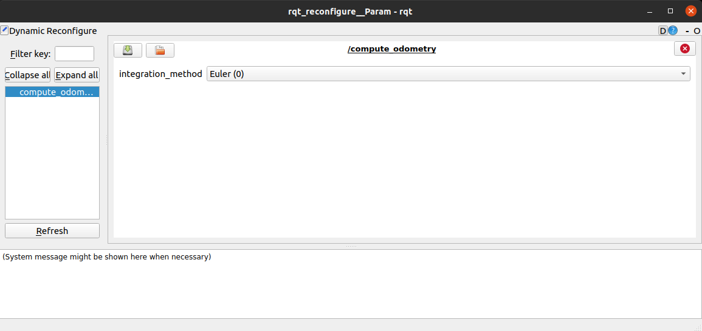
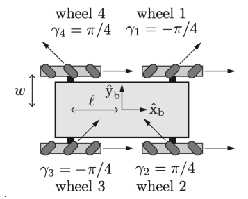
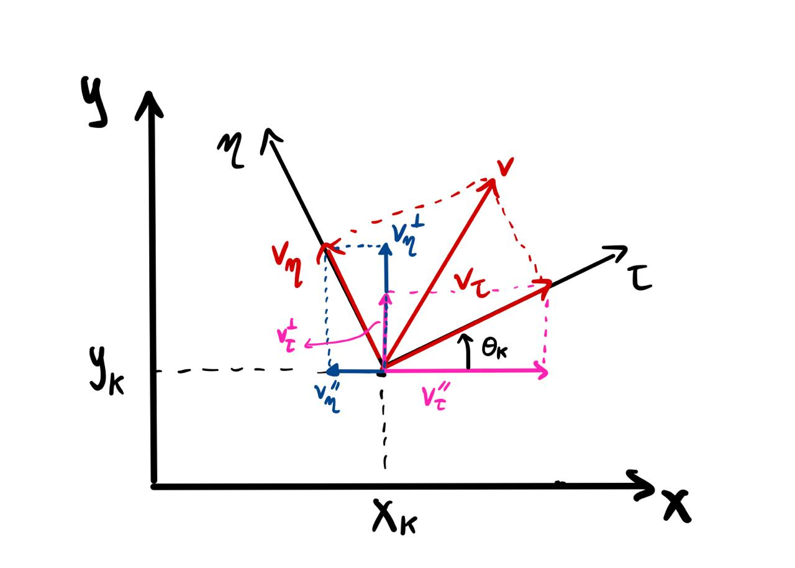
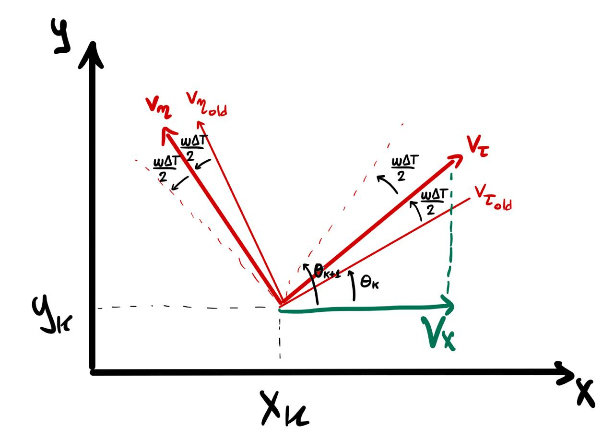
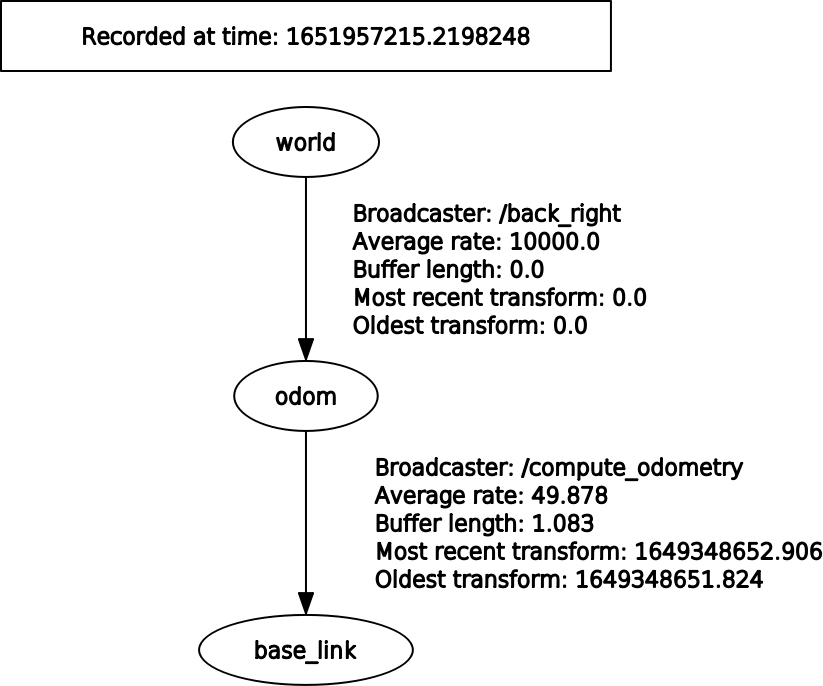

# Omnidirectional Robot Odometry

This repository contains the first laboratory project for the [Robotics course 2021/2022](https://www4.ceda.polimi.it/manifesti/manifesti/controller/ManifestoPublic.do?EVN_DETTAGLIO_RIGA_MANIFESTO=evento&aa=2021&k_cf=225&k_corso_la=481&k_indir=T2A&codDescr=089013&lang=IT&semestre=2&idGruppo=4336&idRiga=271084) of the Polytechnic University of Milan.

The project is implemented in ROS, an open-source robotics middleware suit.

## Requirements

- ROS Melodic (Noetic is okay too)
- C++
- Ubuntu 18.04 (20.04 is okay too)

## Project structure

The project contains one package (`omnidirectional_robot_odometry`), which root folder is the [src/omnidirectional_robot_odometry/](src/omnidirectional_robot_odometry/) folder. We will consider this as root folder.

The source files are under the [src/](src/omnidirectional_robot_odometry/src/) folder:
- `compute_odometry.cpp`: it deals with computing and resetting the odometry. It also broadcasts the odometry with the TF transforms.
- `compute_velocities.cpp`: it computes the robot velocities starting from the wheels information provided by the bag files.
- `compute_wheel_speed`: it computes the angular velocity of each wheel starting from the robot velocities.

Under the [include/omnidirectional_robot_odometry/](src/omnidirectional_robot_odometry/include/omnidirectional_robot_odometry/) folder there are all the header files, plus an utility file used for some constants.

The [launch file](src/omnidirectional_robot_odometry/launch/odom.launch) starts together the three nodes and is also used for static transforms and ROS parameters.

Under [srv/](src/omnidirectional_robot_odometry/srv/), [msg/](src/omnidirectional_robot_odometry/msg/) and [cfg/](src/omnidirectional_robot_odometry/cfg/) there are, respectively, the reset odometry service definition, the custom message definition for the RPMs, and the dynamic configuration definition for changing the integration method at runtime.

Finally are defined `CMakeLists.txt` and `package.xml` for compilation purposes.

If you want to run the bags, you can find them under the [bags/](bags/) folder.

## Getting Started

You can either clone the repository and change directory:
```
$ git clone https://github.com/davide-giacomini/omnidirectional-robot-odometry.git
$ cd omnidirectional-robot-odometry/
```

Or you can download the zip file, and unzip it where you prefer and change the name of the directory in `omnidirectional-robot-odometry/`. Then, you change directory:
```
$ unzip <directory_name.zip> -d <destination_folder>
$ cd <path/to/destination_folder>
$ mv <directory_name/> omnidirectional-robot-odometry/
$ cd omnidirectional-robot-odometry
```

Build the environment with catkin:
```
$ catkin_make
```

Add ROS worspace to your system. Add the end of the `bashrc` file the path to the `devel/setup.bash` file:
```
$ echo "source </path/to/project/folder/>omnidirectional-robot-odometry/devel/setup.bash" >> ~/.bashrc
$ source ~/.bashrc
```

Warning: In case you have already define in your `bashrc` file a path for another workspace, comment or delete it. Each machine must have only one workspace defined.

With the launch file you can start all the nodes at the same time:
```
$ roslaunch omnidirectional_robot_odometry odom.launch
```

Once started, you can use the bags to read from the topics. Notice that the [launch file](src/omnidirectional_robot_odometry/launch/odom.launch) has three different transforms, depending on the bag file used. If you want to correctly visualize the translation from the GT `world` to the `odom` frame, uncomment only the static transformation correspondent to the bag you are using. For example, the static transformation of the first bag is this one:
```
<node pkg="tf2_ros" type="static_transform_publisher" name="back_right" args="0.00815962441265583 0.0030597213190048933 0.3687083423137665 -0.011577633209526539 -0.02075166068971157 -0.019595127552747726 0.9995256066322327 world odom " />
```

Uncomment it when you want to use the first bag.

### Using reset odometry service

To reset the odometry at runtime, you can type on command line:
```
rosservice call /reset_odom <x> <y> <theta>
```
Where you put numbers inside the brackets. For example:
```
rosservice call /reset_odom 2 2 0
```

Notice that if you want to put a negative number, you must type `--` before the parameters. For example:
```
rosservice call /reset_odom -- -1 2.1 1.3
```

### Using dynamic reconfigure

If you want to change at runtime the odometry integration method, you can type on command line:
```
rosrun rqt_reconfigure rqt_reconfigure
```

It will open a window where you can easily choose between Euler and Runge-Kutta integration method:

<p align="left">
    
</p>


## Project Description

In this project we were required to read from a bag file some information and calculate the odometry and other parameters of an omnidirectional robot. A semple is illustrated below.

<p align="left">
    
</p>

We were given:
- Wheels encoder state:
    - RPM (noisy)
    - Ticks (more accurate)
- Nominal robot parameters:
    - Wheel radius (*r*) = 0.07m (could be a bit off)
    - Wheel position along x (*l*) = 0.200m
    - Wheel position along y (*w*) = 0.169m
    - Gear ratio (*T*) = 5:1
    - Encoder resolution(*N*): 42 CPR (Counts Per Rev.) (could be a bit off)
- Ground truth (GT) pose of the robot (acquired with OptiTrack)

And we were required to:
- Compute odometry using appropriate kinematics
    - Compute robot linear and angular velocities `v`, `⍵` from wheel encoders
    - Compute odometry using both Euler and Runge-Kutta integration methods
        - Add ROS parameters for initial pose
    - Calibrate (fine-tune) robot parameters to match ground truth
- Compute wheel control speeds from `v`, `⍵`
- Add a service to reset the odometry to a specified pose **(x,y,θ)**
- Use dynamic reconfigure to select between the desired integration method

We created a package which contains three different nodes. Each node corresponds to a source code file and it is in charge of a different task, which is explained more in detail in the next sections.

## Compute robot velocities

Given the wheel speeds of the robot from the bags, we were required to compute the robot linear and angular velocities. As a reference, we considered the formulas developed by [Taheri et al.](#1) for a mecanum wheeled mobile robot.

[comment]: < special entity html codes: https://www.science.co.il/internet/html/Greek-characters.php, https://www.toptal.com/designers/htmlarrows/math/, and others sites like >
In particular, we are interested in the equations 22, 23 and 24 of the paper, which we report below:
- v<sub>x</sub>(t) = ( &omega;<sub>fl</sub> + &omega;<sub>fr</sub> + &omega;<sub>rl</sub> + &omega;<sub>rr</sub> ) &#8729; <sup>r</sup> &#8725; <sub>4</sub>
- v<sub>y</sub>(t) = ( - &omega;<sub>fl</sub> + &omega;<sub>fr</sub> + &omega;<sub>rl</sub> - &omega;<sub>rr</sub> ) &#8729; <sup>r</sup> &#8725; <sub>4</sub>
- &omega;<sub>z</sub>(t) = ( - &omega;<sub>fl</sub> + &omega;<sub>fr</sub> - &omega;<sub>rl</sub> + &omega;<sub>rr</sub> ) &#8729; <sup>r</sup> &#8725; <sub>4(l<sub>x</sub> + l<sub>y</sub>)</sub>

Where, in our case, the subscripts refer to the position of the wheel (*fl* = front left, *rr* = rear right, etc.).

The node "[compute_velocities](src/omnidirectional_robot_odometry/src/compute_velocities.cpp)" takes the wheel ticks published in the topic `wheel_states` by the bags, and then easily computes the angular velocity of each speed by using this equation:

&omega; = ( <sup>&Delta;<sub>ticks</sub></sup> &#8725; <sub>&Delta;<sub>time</sub></sub> ) &#8729; ( <sup>1</sup> &#8725; <sub>N</sub> ) &#8729; ( <sup>1</sup> &#8725; <sub>T</sub> ) &#8729; 2&pi;

Where <sup>&Delta;<sub>ticks</sub></sup> &#8725; <sub>&Delta;<sub>time</sub></sub> refers to the difference between the number of ticks divided by the period of time that has been measured. Please notice that we divided by the gear ratio because the encoders are located in the motors of the wheels. Once computing each angular velocity, the robot velocities can be computed using the aformentioned three equations, and they are eventually published as topic `cmd_vel`.

## Compute odometry

For this task, we were required to compute the robot odometry starting from the velocities we just calculated in the previous task. Furthermore, we were required to use both Euler and Runge-Kutta integration methods.

After computing the odometry, we published it as topic `odom` and wrote a TF broadcaster having as father the frame `odom` and as children the frame `base_link` (`odom` &#10132; `base_link`), which is basically the Reference System of the center of gravity of the robot. 

All of this can be found in the node "[compute_odometry](src/omnidirectional_robot_odometry/src/compute_odometry.cpp)", which reads from the topic `cmd_vel` the velocities.

### Euler integration method

We used as a reference the set of slides of Professor Matteucci [[2]](#2). From now on we will consider our `odom` frame as the fixed frame of the slides, and our `base_link` frame as the mobile frame of the robot. In case of a *differential drive* (slide 22), it can be seen that we have the x axis of the `base_link` frame always parallel to the direction of the velocity of the robot. This is not true for a *mecanum wheeled robot*, where we have to take into account both the parallel and perpendicular component of the velocity.

At slide number 27, the Euler integration method for *differential drive* is illustrated. We can see that v<sub>k</sub>cos&theta;<sub>k</sub> = v<sub>x</sub>(k) and v<sub>k</sub>sin&theta;<sub>k</sub> = v<sub>y</sub>(k), where v<sub>x</sub> and v<sub>y</sub> are the velocities relative to the `odom` reference frame. We could then generalize the Euler integration method in order to use it for the omnidirectional robot. The generalized equations can be recapped in:
- x<sub>k+1</sub> = x<sub>k</sub> + v<sub>x<sub>k</sub></sub>&#8729;&Delta;T
- y<sub>k+1</sub> = y<sub>k</sub> + v<sub>y<sub>k</sub></sub>&#8729;&Delta;T
- &theta;<sub>k+1</sub> = &theta;<sub>k</sub> + &omega;<sub>k</sub>&#8729;&Delta;T

In case of a *mecanum wheeled robot*, v<sub>x</sub> and v<sub>y</sub> have the perpendicular components too. In the image below you can see the `base_link` as the reference system &tau; / &eta; and the `odom` frame as the reference system x / y , as in the slides.

<p align="left">
    
</p>

With a bit of Euclidean Geometry, it is easy to obtain:
- v<sub>x<sub>k</sub></sub> = v<sub>&tau;<sub>k</sub></sub>cos&theta;<sub>k</sub> - v<sub>&eta;<sub>k</sub></sub>sin&theta;<sub>k</sub>
- v<sub>y<sub>k</sub></sub> = v<sub>&tau;<sub>k</sub></sub>sin&theta;<sub>k</sub> + v<sub>&eta;<sub>k</sub></sub>cos&theta;<sub>k</sub>

Applying these equations to the above ones, we can obtain the odometry starting from the components of the velocities relative to the `base_frame` of our omnidirectional robot.

### Runge-Kutta integration method

Starting from the assumptions made in the section before, we took as a reference the equations for *differential drive* listed at slide 28 ([[2]](#2)). In case of a *mecanum wheeled robot*, we split again the two components. It is illustrated in the image below.

<p align="left">
    
</p>

Putting all together, the three equations for Runge-Kutta are:
- x<sub>k+1</sub> = x<sub>k</sub> + v<sub>&tau;<sub>k</sub></sub>cos(&theta;<sub>k</sub> + <sup>&omega;<sub>k</sub>&Delta;T</sup> &#8725; <sub>2</sub>)&#8729;&Delta;T - v<sub>&eta;<sub>k</sub></sub>sin(&theta;<sub>k</sub> + <sup>&omega;<sub>k</sub>&Delta;T</sup> &#8725; <sub>2</sub>)&#8729;&Delta;T
- y<sub>k+1</sub> = y<sub>k</sub> + v<sub>&tau;<sub>k</sub></sub>sin(&theta;<sub>k</sub> + <sup>&omega;<sub>k</sub>&Delta;T</sup> &#8725; <sub>2</sub>)&#8729;&Delta;T - v<sub>&eta;<sub>k</sub></sub>cos(&theta;<sub>k</sub> + <sup>&omega;<sub>k</sub>&Delta;T</sup> &#8725; <sub>2</sub>)&#8729;&Delta;T
- &theta;<sub>k+1</sub> = &theta;<sub>k</sub> + &omega;<sub>k</sub>&#8729;&Delta;T

## ROS parameters for initial pose

We were required to add ROS parameters for defining the initial pose of the robot (x, y, &theta;). You can find them in the [launch file](src/omnidirectional_robot_odometry/launch/odom.launch), at line 3-4-5:

```
<param name="init_pose_x" value="0"/>
<param name="init_pose_y" value="0"/>
<param name="init_pose_th" value="0"/>
```

Those values are then used for initializing pose in the [compute_odometry](src/omnidirectional_robot_odometry/src/compute_odometry.cpp) node.

Notice that the initial pose values are referred to the `odom` frame. Considered that, at the beginning of the odometry, `base_link` overlaps `odom`, those values are put to zero.

## TF tree

In the [launch file](src/omnidirectional_robot_odometry/launch/odom.launch) you can also find three different TF static transforms `world` &#10132; `odom`. This is because the topic `robot/pose` of the bags refers to the frame `world`, hence we implemented a static translation taking into account the first values of the ground truth. In this way, our odometry better overlaps the GT odometry when visualized on `rviz`. There are three different transforms because each bag starts from a different position in `world`.

Below we show the structure of the final TF tree:

<p align="left">
    
</p>

## Compute Control

We were required to compute wheel speeds in RPM starting from the velocities calculated in [compute_velocities](src/omnidirectional_robot_odometry/src/compute_velocities.cpp).

The node [compute_wheel_speed](src/omnidirectional_robot_odometry/src/compute_wheel_speed.cpp) takes the velocities from the topic `cmd_vel` and then computes each wheel angular velocity using the system of equations number 20 of [Taheri et al.](#1). Those equations find the angular velocities in [rad/sec], and moreover they don't take into account the gear ratio between the motor and the wheel. Hence, we corrected them for our  situation multiplying by 60&#8729;T.  We report below the final equations:
- &omega;<sub>fl</sub> = <sup>1</sup> &#8725; <sub>r</sub> &#8729; ( v<sub>x</sub> - v<sub>y</sub> - (l<sub>x</sub> + l<sub>y</sub>)&#8729;&omega;<sub>z</sub> ) &#8729; 60 &#8729; T
- &omega;<sub>fr</sub> = <sup>1</sup> &#8725; <sub>r</sub> &#8729; ( v<sub>x</sub> + v<sub>y</sub> + (l<sub>x</sub> + l<sub>y</sub>)&#8729;&omega;<sub>z</sub> ) &#8729; 60 &#8729; T
- &omega;<sub>rl</sub> = <sup>1</sup> &#8725; <sub>r</sub> &#8729; ( v<sub>x</sub> + v<sub>y</sub> - (l<sub>x</sub> + l<sub>y</sub>)&#8729;&omega;<sub>z</sub> ) &#8729; 60 &#8729; T
- &omega;<sub>rr</sub> = <sup>1</sup> &#8725; <sub>r</sub> &#8729; ( v<sub>x</sub> - v<sub>y</sub> + (l<sub>x</sub> + l<sub>y</sub>)&#8729;&omega;<sub>z</sub> ) &#8729; 60 &#8729; T

Subsequently, the node publishes the angular velocities as topic `wheels_rpm` using a **custom** message, called `CustomRpm`.

### CustomRpm Structure

The structure of the custom message can be found in the file `CustomRpm.msg` under the [msg/](src/omnidirectional_robot_odometry/msg/) folder. It has got an `Header` and one `float64` for each wheel. The `stamp` and the `frame_id` of the header are filled with the `stamp` and the `frame_id` of the message taken from the topic `cmd_vel`.

## Reset Service

We were asked to define a service for resetting the odometry to any given pose (x,y,&theta;). The file `ResetOdometry.srv` under the [srv/](src/omnidirectional_robot_odometry/srv/) folder defines a service called `/reset_odometry` that takes as input the x, y and &theta;. The function `ComputeOdometry::reset_odometry` in [compute_odometry.cpp](src/omnidirectional_robot_odometry/src/compute_odometry.cpp.cpp) takes as input the pose given and resets even at runtime the odometry.

## Integration Method Selector

We were finally required to use dynamic reconfigure to select the odometry integration method (either Euler or Runge-Kutta). The reconfiguration is defined in `parameters.cfg`, under the folder [cfg/](src/omnidirectional_robot_odometry/cfg/). The constants "Euler" and "RK" are then used in [compute_odometry.cpp](src/omnidirectional_robot_odometry/src/compute_odometry.cpp) for deciding the integration method at runtime.

## Authors

- Davide Giacomini ([GitHub](https://github.com/davide-giacomini), [Linkedin](https://www.linkedin.com/in/davide-giacomini/), [email](mailto://giacomini.davide@outlook.com)) --- Person Code: 10567357
- Giuseppe Cerruto ([GitHub](https://github.com/GiuseppeCerruto)) --- Person Code: 10749409

## References

<a id="1">[1]</a> 
Taheri, Hamid, Bing Qiao, and Nurallah Ghaeminezhad. "Kinematic model of a four mecanum wheeled mobile robot." International journal of computer applications 113.3 (2015): 6-9.

<a id="2">[2]</a>
Matteo Matteucci. "Robot Localization - Wheels odometry", http://chrome.ws.dei.polimi.it/images/3/3e/Robotics_03_2021_Odometry.pdf
